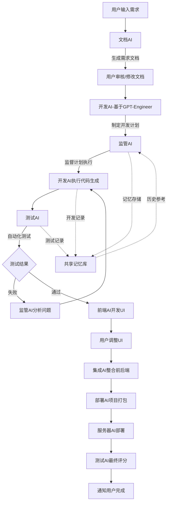

# GPT-Engineer 深度集成改造方案

## 1. 项目分析总结

### 1.1 核心架构分析

GPT-Engineer 项目的核心架构包含以下关键组件：

#### 1.1.1 核心类结构
- **AI类** (`gpt_engineer/core/ai.py`): 
  - 负责与语言模型的交互
  - 管理对话历史和消息序列化
  - 实现回退策略和Token使用统计

- **BaseAgent/SimpleAgent** (`gpt_engineer/core/base_agent.py`, `gpt_engineer/core/default/simple_agent.py`):
  - 抽象代理接口，定义 `init()` 和 `improve()` 方法
  - SimpleAgent实现具体的代码生成和改进逻辑

- **内存管理** (`gpt_engineer/core/default/disk_memory.py`):
  - DiskMemory类实现基于文件系统的键值存储
  - 支持文本文件和图片文件的存储与检索

- **执行环境** (`gpt_engineer/core/default/disk_execution_env.py`):
  - DiskExecutionEnv类管理代码执行环境
  - 支持文件上传、下载和命令执行

#### 1.1.2 核心工作流程
1. **代码生成流程** (`gen_code`):
   - 基于用户提示生成代码文件
   - 使用预设的系统提示词指导生成

2. **入口点生成** (`gen_entrypoint`):
   - 生成项目的执行脚本
   - 自动安装依赖和运行代码

3. **代码执行** (`execute_entrypoint`):
   - 执行生成的入口脚本
   - 实时显示执行输出

4. **代码改进** (`improve_fn`):
   - 基于用户反馈改进现有代码
   - 支持diff格式的增量修改

### 1.2 项目依赖与配置
- **Python版本**: 3.10-3.13
- **主要依赖**: OpenAI API, LangChain, Typer
- **打包方式**: Poetry + Docker
- **部署**: 支持PyPI发布和Docker容器化

## 2. 多AI协作系统设计方案

### 2.1 系统架构图



### 2.2 核心AI角色定义

#### 2.2.1 开发AI（基于GPT-Engineer改造）
- **职责**: 根据需求文档进行代码生成和迭代开发
- **输入**: 需求文档、用户反馈、测试结果
- **输出**: 代码文件、技术文档、开发日志

#### 2.2.2 监管AI
- **职责**: 监督开发过程、记录开发历史、质量控制
- **输入**: 开发计划、代码变更、测试结果
- **输出**: 质量报告、改进建议、风险警告

#### 2.2.3 测试AI
- **职责**: 自动生成测试用例、执行测试、验证功能
- **输入**: 代码文件、功能需求
- **输出**: 测试报告、bug报告、覆盖率分析

## 3. 二次开发技术方案

### 3.1 核心接口设计

#### 3.1.1 多AI协作接口
```python
class MultiAIOrchestrator:
    """多AI协作编排器"""
    
    def __init__(self):
        self.document_ai = DocumentAI()
        self.dev_ai = EnhancedDevAI()  # 基于GPT-Engineer改造
        self.supervisor_ai = SupervisorAI()
        self.test_ai = TestAI()
        self.frontend_ai = FrontendAI()
        self.deploy_ai = DeployAI()
        self.shared_memory = SharedMemoryManager()
    
    async def execute_workflow(self, user_requirement: str) -> ProjectResult:
        """执行完整的开发工作流"""
        pass
```

#### 3.1.2 增强的开发AI接口
```python
class EnhancedDevAI(SimpleAgent):
    """增强的开发AI，基于GPT-Engineer的SimpleAgent"""
    
    def __init__(self, supervisor_ai, shared_memory):
        super().__init__()
        self.supervisor_ai = supervisor_ai
        self.shared_memory = shared_memory
        self.test_ai = None
    
    def generate_with_supervision(self, prompt: Prompt) -> FilesDict:
        """在监管AI监督下生成代码"""
        pass
    
    def iterative_develop(self, requirements: Dict, test_feedback: TestResult) -> FilesDict:
        """基于测试反馈进行迭代开发"""
        pass
```

#### 3.1.3 监管AI接口
```python
class SupervisorAI:
    """监管AI，负责监督和记忆管理"""
    
    def monitor_development(self, dev_plan: DevPlan, code_changes: FilesDict) -> SupervisionResult:
        """监督开发过程"""
        pass
    
    def store_memory(self, event: DevelopmentEvent):
        """存储开发事件到记忆库"""
        pass
    
    def analyze_quality(self, files_dict: FilesDict) -> QualityReport:
        """分析代码质量"""
        pass
```

#### 3.1.4 测试AI接口
```python
class TestAI:
    """测试AI，负责自动化测试"""
    
    def generate_tests(self, files_dict: FilesDict, requirements: Dict) -> TestSuite:
        """生成测试用例"""
        pass
    
    def execute_tests(self, files_dict: FilesDict, test_suite: TestSuite) -> TestResult:
        """执行测试"""
        pass
    
    def analyze_coverage(self, test_result: TestResult) -> CoverageReport:
        """分析测试覆盖率"""
        pass
```

#### 3.1.5 部署AI接口
```python
class DeployAI:
    """部署AI，负责项目打包和部署"""
    
    def package_project(self, files_dict: FilesDict, config: DeployConfig) -> PackageResult:
        """打包项目"""
        pass
    
    def upload_to_server(self, package: PackageResult, server_config: ServerConfig) -> DeployResult:
        """上传到服务器"""
        pass
    
    def monitor_deployment(self, deploy_result: DeployResult) -> DeploymentStatus:
        """监控部署状态"""
        pass
```

### 3.2 共享记忆系统设计

#### 3.2.1 记忆管理器
```python
class SharedMemoryManager:
    """共享记忆管理器"""
    
    def __init__(self, base_path: str):
        self.memory = DiskMemory(base_path)
        self.event_log = EventLogger()
        self.knowledge_base = KnowledgeBase()
    
    def store_development_event(self, event: DevelopmentEvent):
        """存储开发事件"""
        pass
    
    def retrieve_similar_cases(self, current_context: Dict) -> List[HistoricalCase]:
        """检索相似历史案例"""
        pass
    
    def update_knowledge_base(self, new_knowledge: Knowledge):
        """更新知识库"""
        pass
```

### 3.3 工作流程编排

#### 3.3.1 主工作流
```python
async def main_workflow(user_requirement: str) -> ProjectResult:
    """主工作流程"""
    
    # 1. 文档生成阶段
    doc_result = await document_ai.generate_document(user_requirement)
    doc_approved = await user_review_document(doc_result)
    
    # 2. 开发计划制定
    dev_plan = await dev_ai.create_development_plan(doc_approved)
    
    # 3. 监管AI开始监督
    supervisor_ai.start_supervision(dev_plan)
    
    # 4. 迭代开发循环
    while not development_complete:
        # 代码生成
        code_result = await dev_ai.generate_with_supervision(dev_plan.current_task)
        
        # 监管记录
        await supervisor_ai.record_development_step(code_result)
        
        # 测试验证
        test_result = await test_ai.execute_tests(code_result.files)
        
        if test_result.passed:
            dev_plan.mark_task_complete()
        else:
            # 分析问题并重新开发
            issues = await supervisor_ai.analyze_issues(test_result)
            dev_plan.add_fixes(issues)
    
    # 5. 前端开发（如果需要）
    if dev_plan.requires_frontend:
        frontend_result = await frontend_ai.develop_ui(code_result.files)
        integration_result = await integration_ai.integrate_frontend_backend(
            code_result.files, frontend_result.files
        )
    
    # 6. 项目打包和部署
    package_result = await deploy_ai.package_project(final_files)
    deploy_result = await deploy_ai.upload_to_server(package_result)
    
    # 7. 最终验证
    final_score = await test_ai.final_evaluation(deploy_result)
    
    return ProjectResult(
        files=final_files,
        deployment=deploy_result,
        score=final_score
    )
```

## 4. 具体实现计划

### 4.1 第一阶段：基础改造（2-3周）
1. **扩展SimpleAgent类**
   - 添加监管AI集成接口
   - 实现共享记忆访问
   - 增加测试反馈处理机制

2. **实现共享记忆系统**
   - 基于DiskMemory扩展SharedMemoryManager
   - 实现事件日志记录
   - 建立知识库检索机制

3. **开发监管AI基础功能**
   - 实现代码质量分析
   - 开发进度监控机制
   - 建立风险预警系统

### 4.2 第二阶段：测试AI集成（2-3周）
1. **实现测试AI**
   - 基于代码生成测试用例
   - 集成现有测试框架（pytest, unittest）
   - 实现测试执行和报告生成

2. **完善迭代开发机制**
   - 基于测试结果的代码修复
   - 实现智能错误诊断
   - 优化代码生成策略

### 4.3 第三阶段：完整工作流（3-4周）
1. **集成文档AI和前端AI**
   - 实现需求文档生成
   - 开发UI生成功能
   - 完善前后端集成

2. **实现部署AI**
   - 项目自动打包功能
   - 服务器部署接口
   - 部署状态监控

3. **工作流编排器**
   - 实现多AI协作编排
   - 优化任务调度机制
   - 完善错误处理和恢复

### 4.4 第四阶段：优化和测试（2-3周）
1. **性能优化**
   - 并行处理优化
   - 内存使用优化
   - API调用优化

2. **完整测试**
   - 单元测试覆盖
   - 集成测试验证
   - 端到端测试

## 5. 关键技术要点

### 5.1 监管AI实现要点
- **代码质量分析**: 使用AST分析、静态代码检查
- **进度监控**: 基于Git提交记录和文件变更
- **记忆存储**: 结构化存储开发事件和决策过程

### 5.2 测试AI实现要点
- **测试生成**: 基于函数签名和需求描述生成测试用例
- **自动执行**: 集成pytest框架自动运行测试
- **智能诊断**: 分析测试失败原因并提供修复建议

### 5.3 部署AI实现要点
- **项目打包**: 自动生成requirements.txt、Dockerfile等
- **服务器集成**: 支持多种部署平台（Docker, Kubernetes, 云平台）
- **状态监控**: 实时监控应用运行状态

## 6. 预期效果

### 6.1 功能增强
- **自动化程度提升**: 从单一代码生成扩展到完整项目开发流程
- **质量保证**: 通过监管AI和测试AI确保代码质量
- **记忆能力**: 累积开发经验，提升后续项目开发效率

### 6.2 用户体验改进
- **一站式服务**: 从需求到部署的完整自动化流程
- **智能反馈**: 提供详细的开发进展和质量报告
- **可控性增强**: 用户可在关键节点介入和调整

### 6.3 技术价值
- **可扩展架构**: 模块化设计支持功能扩展
- **知识积累**: 建立可复用的开发知识库
- **工程化实践**: 体现AI辅助软件工程的最佳实践

此方案将GPT-Engineer从一个代码生成工具升级为完整的AI驱动软件开发平台，实现真正意义上的自动化软件开发流程。