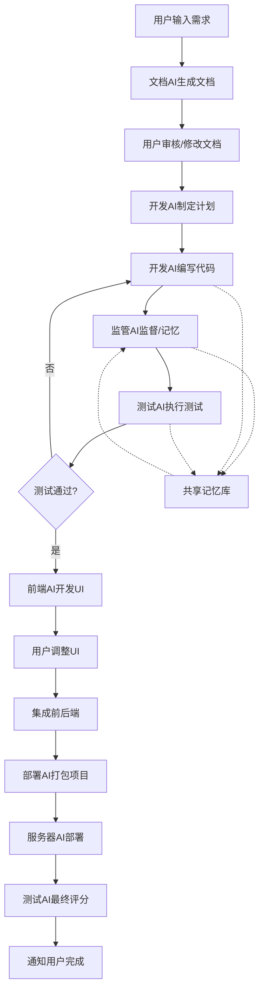

# 多AI协作开发系统

基于GPT-Engineer的深度集成多AI协作开发平台，实现从需求到部署的全自动化软件开发流程。

## 🚀 系统概述

本系统将GPT-Engineer从单一的代码生成工具升级为完整的AI驱动软件开发平台，通过多个专业AI角色的协作，实现真正意义上的自动化软件开发。

### 核心特性

- **🤖 多AI协作**: 文档AI、开发AI、监管AI、测试AI、前端AI、部署AI等专业角色协作
- **📋 全流程自动化**: 从需求分析到部署监控的完整自动化流程
- **🧠 智能记忆系统**: 累积开发经验，持续学习和优化
- **🔍 质量保证**: 自动化代码质量分析和测试验证
- **📦 一键部署**: 自动化项目打包和多平台部署
- **📊 实时监控**: 部署状态监控和性能分析

## 🏗️ 系统架构



### 核心组件

#### 1. **增强开发AI** (`EnhancedDevAI`)
基于GPT-Engineer的SimpleAgent扩展：
- 集成监管AI监督机制
- 支持测试反馈的迭代开发
- 访问共享记忆的历史经验
- 智能代码生成和改进

#### 2. **监管AI** (`SupervisorAI`)
负责质量控制和进度监督：
- 实时代码质量分析
- 开发进度监控
- 风险预警和建议
- 开发历史记录管理

#### 3. **测试AI** (`TestAI`)
自动化测试和验证：
- 智能测试用例生成
- 自动化测试执行
- 测试覆盖率分析
- 失败原因诊断

#### 4. **部署AI** (`DeployAI`)
项目打包和部署：
- 多格式项目打包（Docker、ZIP、TAR等）
- 多平台部署支持
- 配置文件自动生成
- 部署状态监控

#### 5. **共享记忆系统** (`SharedMemoryManager`)
知识积累和经验学习：
- 开发事件存储和检索
- 相似案例智能匹配
- 知识库持续更新
- 项目状态跟踪

#### 6. **多AI编排器** (`MultiAIOrchestrator`)
工作流程协调和管理：
- 多AI协作编排
- 工作流状态管理
- 错误处理和恢复
- 进度跟踪和报告

## 📁 项目结构

```
multi_ai_system/
├── core/
│   ├── base_interfaces.py      # 基础接口定义
│   └── enhanced_dev_ai.py      # 增强开发AI实现
├── ai/
│   ├── supervisor_ai.py        # 监管AI实现
│   ├── test_ai.py             # 测试AI实现
│   └── deploy_ai.py           # 部署AI实现
├── memory/
│   └── shared_memory.py       # 共享记忆系统
├── deployment/
│   └── server_interface.py   # 服务器AI接口
├── examples/
│   └── usage_example.py      # 使用示例
├── orchestrator.py           # 多AI编排器
└── README_多AI协作系统.md    # 本文档
```

## 🚦 快速开始

### 1. 环境准备

```bash
# 安装依赖
pip install gpt-engineer openai langchain python-dotenv

# 设置环境变量
export OPENAI_API_KEY="your-openai-api-key"
```

### 2. 基础使用

```python
import asyncio
from multi_ai_system.orchestrator import MultiAIOrchestrator

async def main():
    # 用户需求
    requirement = """
    开发一个任务管理系统，包含：
    - 任务的增删改查
    - 用户认证
    - Web界面
    - RESTful API
    """
    
    # 创建编排器
    orchestrator = MultiAIOrchestrator(
        work_dir="./my_project",
        ai_config={'model_name': 'gpt-4o'}
    )
    
    # 执行开发流程
    result = await orchestrator.execute_workflow(
        user_requirement=requirement,
        workflow_options={
            'include_frontend': True,
            'auto_deploy': True,
            'deploy_platform': 'docker'
        }
    )
    
    print(f"项目开发完成！评分: {result.final_score}/100")
    if result.deployment and result.deployment.url:
        print(f"访问地址: {result.deployment.url}")

# 运行
asyncio.run(main())
```

### 3. 高级配置

```python
# 自定义AI配置
ai_config = {
    'model_name': 'gpt-4o',
    'temperature': 0.1
}

# 工作流配置
workflow_config = {
    'max_dev_iterations': 5,        # 最大开发迭代次数
    'package_type': 'docker',       # 打包类型
    'include_frontend': True,       # 是否包含前端
    'auto_deploy': False           # 是否自动部署
}

orchestrator = MultiAIOrchestrator(
    work_dir="./advanced_project",
    ai_config=ai_config,
    workflow_config=workflow_config
)
```

## 🔧 高级功能

### 1. 监管AI质量控制

```python
from multi_ai_system.ai.supervisor_ai import SupervisorAI
from gpt_engineer.core.ai import AI

# 创建监管AI
supervisor = SupervisorAI(AI())

# 分析代码质量
quality_report = supervisor.analyze_quality(files_dict)
print(f"质量评分: {quality_report.overall_score}/100")
print(f"发现问题: {len(quality_report.issues)} 个")
```

### 2. 测试AI自动化测试

```python
from multi_ai_system.ai.test_ai import TestAI

# 创建测试AI
test_ai = TestAI(AI())

# 生成测试用例
test_files = test_ai.generate_tests(code_files, requirements)

# 执行测试
test_result = test_ai.execute_tests(code_files)
print(f"测试通过率: {test_result.passed_tests}/{test_result.total_tests}")
```

### 3. 共享记忆系统

```python
from multi_ai_system.memory.shared_memory import SharedMemoryManager

# 创建记忆管理器
memory = SharedMemoryManager("./memory")

# 查找相似案例
context = {'requirements': {'type': 'web_app', 'tech': 'python'}}
similar_cases = memory.find_similar_cases(context)

# 获取统计信息
stats = memory.get_statistics()
print(f"历史项目数: {stats['events']['projects']}")
```

### 4. 服务器部署接口

```python
from multi_ai_system.deployment.server_interface import ServerAIInterface

# 配置服务器
server_config = {
    'api_base_url': 'https://your-server.com',
    'api_key': 'your-api-key'
}

server_interface = ServerAIInterface(server_config)

# 上传和部署项目
upload_result = server_interface.upload_project_package(package_result)
deploy_result = server_interface.deploy_project(upload_result['upload_id'])
```

## 📊 工作流阶段

系统包含以下9个主要阶段：

1. **文档生成** - 将用户需求转换为结构化需求文档
2. **开发计划** - 制定详细的开发计划和任务分解
3. **迭代开发** - 基于计划进行代码生成和迭代改进
4. **测试验证** - 自动生成测试用例并执行验证
5. **前端开发** - 生成用户界面（可选）
6. **系统集成** - 整合前后端代码
7. **项目打包** - 生成部署包和配置文件
8. **自动部署** - 部署到目标环境（可选）
9. **最终评估** - 综合评估项目质量和性能

## 🔍 监控和分析

### 实时进度跟踪

```python
# 获取当前会话状态
status = orchestrator.get_session_status()
print(f"当前阶段: {status['current_stage']}")
print(f"完成进度: {status['progress']}%")
```

### 事件处理机制

```python
# 注册自定义事件处理器
async def custom_handler(event):
    print(f"事件: {event.event_type} - {event.description}")

orchestrator.register_event_handler('code_generation', custom_handler)
```

### 部署监控

```python
# 监控部署状态
monitoring_data = server_interface.monitor_deployment(deployment_id)
print(f"服务状态: {monitoring_data['health']}")
print(f"响应时间: {monitoring_data['metrics']['response_time']}ms")

# 获取部署日志
logs = server_interface.get_deployment_logs(deployment_id, lines=100)
```

## 🛠️ 自定义扩展

### 1. 添加新的AI角色

```python
from multi_ai_system.core.base_interfaces import BaseSupervisorAI

class CustomAI(BaseSupervisorAI):
    def custom_analysis(self, code):
        # 实现自定义分析逻辑
        pass
```

### 2. 扩展工作流阶段

```python
class CustomOrchestrator(MultiAIOrchestrator):
    async def _stage_custom_processing(self, data):
        # 添加自定义处理阶段
        pass
```

### 3. 自定义部署平台

```python
class CustomDeployAI(DeployAI):
    def _deploy_to_custom_platform(self, package, config, deployment_id):
        # 实现自定义部署逻辑
        pass
```

## 📈 性能优化

### 1. 并行处理

系统支持多个AI角色的并行工作，可通过配置优化性能：

```python
workflow_config = {
    'parallel_testing': True,      # 并行执行测试
    'concurrent_analysis': True,   # 并发质量分析
    'async_deployment': True       # 异步部署
}
```

### 2. 缓存机制

共享记忆系统内置缓存机制，减少重复计算：

```python
# 缓存配置
memory_config = {
    'cache_ttl': 3600,           # 缓存有效期（秒）
    'max_cache_size': 1000,      # 最大缓存条目数
    'enable_similarity_cache': True  # 启用相似性缓存
}
```

## 🔒 安全考虑

### 1. API密钥管理

```python
# 使用环境变量存储敏感信息
import os
from dotenv import load_dotenv

load_dotenv()

server_config = {
    'api_key': os.getenv('SERVER_API_KEY'),
    'openai_key': os.getenv('OPENAI_API_KEY')
}
```

### 2. 代码安全检查

监管AI内置安全模式检查：

```python
# 安全风险检测
risk_patterns = {
    'security_risks': [
        r'password\s*=\s*["\'][^"\']+["\']',  # 硬编码密码
        r'api_key\s*=\s*["\'][^"\']+["\']',   # 硬编码API密钥
    ]
}
```

## 🐛 故障排除

### 常见问题

1. **API密钥错误**
   ```bash
   export OPENAI_API_KEY="your-valid-key"
   ```

2. **内存不足**
   ```python
   # 清理旧数据
   memory.cleanup_old_data(days_to_keep=7)
   ```

3. **部署失败**
   ```python
   # 检查部署日志
   logs = server_interface.get_deployment_logs(deployment_id)
   ```

### 调试模式

```python
import logging

# 启用详细日志
logging.basicConfig(level=logging.DEBUG)

# 启用AI调试模式
ai_config = {'debug': True, 'verbose': True}
```

## 🤝 贡献指南

欢迎贡献代码和改进建议！

### 开发环境设置

```bash
# 克隆项目
git clone <repository-url>
cd multi-ai-system

# 安装开发依赖
pip install -r requirements-dev.txt

# 运行测试
pytest tests/

# 代码格式化
black multi_ai_system/
```

### 贡献流程

1. Fork 项目
2. 创建特性分支 (`git checkout -b feature/amazing-feature`)
3. 提交更改 (`git commit -m 'Add amazing feature'`)
4. 推送到分支 (`git push origin feature/amazing-feature`)
5. 创建 Pull Request

## 📄 许可证

本项目基于 MIT 许可证开源 - 查看 [LICENSE](LICENSE) 文件了解详情。

## 🙏 致谢

- 感谢 [GPT-Engineer](https://github.com/gpt-engineer-org/gpt-engineer) 项目提供的基础框架
- 感谢 OpenAI 提供的强大语言模型
- 感谢所有贡献者的支持和反馈

## 📞 联系我们

- 项目主页: [GitHub Repository](https://github.com/your-org/multi-ai-system)
- 问题反馈: [Issues](https://github.com/your-org/multi-ai-system/issues)
- 讨论区: [Discussions](https://github.com/your-org/multi-ai-system/discussions)

---

**多AI协作开发系统** - 让AI为您构建完整的软件项目！ 🚀