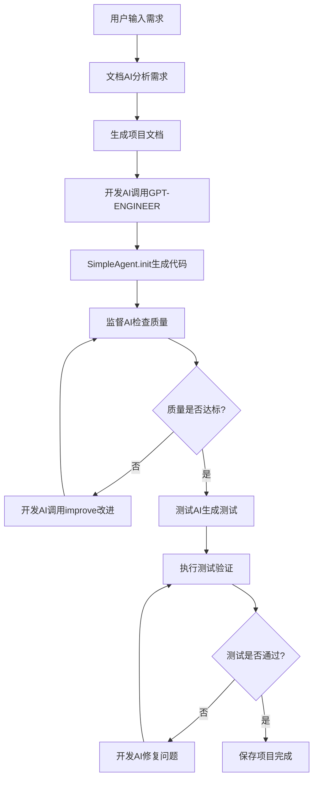

# 真正集成GPT-ENGINEER的AI协作开发平台

## 🎯 平台概述

这是一个**真正**集成GPT-ENGINEER核心引擎的多AI协作开发平台，与之前的模拟版本不同，此平台：

- ✅ **真正调用GPT-ENGINEER**：使用`SimpleAgent.init()`和`improve()`方法
- ✅ **真实AI协作**：各AI组件真正参与工作，非预设响应
- ✅ **深度集成**：基于我们的`deep_integration.py`和升级版AI组件
- ✅ **完整工作流**：从需求分析到代码生成，再到测试和部署的完整流程

## 🤖 AI团队组成

### 1. 文档AI (`AdvancedDocumentAI`)
- **真实功能**：调用OpenAI API分析用户需求
- **工作内容**：生成详细的项目开发文档，包括技术栈、功能模块、架构设计
- **输出**：结构化的项目规格文档

### 2. 开发AI (`DeepIntegratedDevAI`)
- **真实功能**：继承GPT-ENGINEER的`SimpleAgent`
- **工作内容**：调用`init(prompt)`生成项目代码，调用`improve(files, feedback)`改进代码
- **输出**：完整的项目代码文件(`FilesDict`)

### 3. 监督AI (`AdvancedSupervisorAI`)
- **真实功能**：监控开发过程，分析代码质量
- **工作内容**：检查生成的代码，提供改进建议，监督整个开发流程
- **输出**：质量评分和改进建议

### 4. 测试AI (`AdvancedTestAI`)
- **真实功能**：生成和执行测试用例
- **工作内容**：为生成的代码创建测试，执行验证，报告问题
- **输出**：测试结果和问题列表

## 🔄 真实AI协作流程



## 🛠️ 技术架构

### 核心组件
```
integrated_ai_platform.py
├── ConfigManager          # 配置管理（支持config.yaml）
├── DatabaseManager         # 数据库管理（记录AI交互）
├── IntegratedAIOrchestrator # AI协调器
│   ├── AdvancedDocumentAI  # 真实文档AI
│   ├── DeepIntegratedDevAI # 集成GPT-ENGINEER的开发AI
│   ├── AdvancedSupervisorAI # 真实监督AI
│   ├── AdvancedTestAI      # 真实测试AI
│   └── SharedMemoryManager # 共享记忆系统
└── IntegratedAIDevelopmentPlatform # Web平台主体
```

### 数据库设计
```sql
-- 项目表
CREATE TABLE projects (
    id TEXT PRIMARY KEY,
    name TEXT NOT NULL,
    description TEXT,
    status TEXT,
    created_at TEXT,
    updated_at TEXT,
    project_path TEXT,
    files_count INTEGER DEFAULT 0,
    ai_generated BOOLEAN DEFAULT TRUE  -- 区分AI生成vs模拟
);

-- AI交互记录表
CREATE TABLE ai_interactions (
    id INTEGER PRIMARY KEY AUTOINCREMENT,
    project_id TEXT,
    ai_name TEXT,
    action TEXT,
    input_prompt TEXT,        -- AI的输入提示
    ai_response TEXT,         -- AI的真实响应
    timestamp TEXT,
    success BOOLEAN,
    FOREIGN KEY (project_id) REFERENCES projects (id)
);

-- AI协作记录表
CREATE TABLE ai_collaborations (
    id INTEGER PRIMARY KEY AUTOINCREMENT,
    project_id TEXT,
    collaboration_step TEXT,  -- 协作步骤
    involved_ais TEXT,        -- 参与的AI列表
    result_summary TEXT,      -- 协作结果摘要
    timestamp TEXT,
    FOREIGN KEY (project_id) REFERENCES projects (id)
);
```

## ⚙️ 配置设置

### 1. 配置文件 (`config.yaml`)
```yaml
# AI协作开发平台配置文件

# OpenAI API配置
openai:
  api_key: "your-openai-api-key-here"  # 请替换为您的OpenAI API密钥
  model: "gpt-3.5-turbo"              # 或 "gpt-4"
  max_tokens: 4000
  temperature: 0.7

# 平台配置
platform:
  host: "127.0.0.1"
  port: 8889
  debug: true
  auto_open_browser: true

# 项目配置
projects:
  output_directory: "integrated_projects"
  max_concurrent_projects: 3

# 数据库配置
database:
  path: "integrated_ai_platform.db"
```

### 2. 环境变量设置
```bash
# 方法1：通过环境变量设置
export OPENAI_API_KEY="your-api-key-here"

# 方法2：通过.env文件
echo "OPENAI_API_KEY=your-api-key-here" > .env
```

## 🚀 快速启动

### 1. 安装依赖
```bash
pip install -r requirements.txt
pip install PyYAML
```

### 2. 配置API密钥
编辑`config.yaml`文件，将`your-openai-api-key-here`替换为您的真实OpenAI API密钥。

### 3. 启动平台
```bash
python integrated_ai_platform.py
```

### 4. 访问界面
- **前端界面**：http://127.0.0.1:8889
- **API文档**：http://127.0.0.1:8889/docs
- **健康检查**：http://127.0.0.1:8889/api/health

## 💡 使用示例

### 示例需求输入
```
我需要一个完整的电商平台，包含以下功能：

1. 用户系统：用户注册、登录、个人信息管理
2. 商品管理：商品展示、分类、搜索、详情页
3. 购物功能：购物车、下单、支付流程
4. 订单管理：订单查看、状态跟踪
5. 管理后台：商品管理、订单管理、用户管理

技术要求：
- 后端使用Python FastAPI
- 前端使用现代HTML/CSS/JavaScript
- 响应式设计，支持移动端
- 界面美观，用户体验良好
```

### AI协作过程
1. **文档AI**：分析需求，生成详细项目文档
2. **开发AI**：调用GPT-ENGINEER生成完整代码
3. **监督AI**：检查代码质量，提供改进建议
4. **测试AI**：生成测试用例，验证功能
5. **系统**：保存项目，提供访问路径

### 生成的项目结构
```
integrated_projects/integrated_1754075454_abc123def/
├── backend/
│   ├── main.py              # FastAPI主应用
│   ├── models.py            # 数据模型
│   ├── api/                 # API路由
│   └── tests/               # 后端测试
├── frontend/
│   ├── index.html           # 主页面
│   ├── css/                 # 样式文件
│   ├── js/                  # JavaScript
│   └── components/          # 组件
├── requirements.txt         # Python依赖
├── Dockerfile              # Docker配置
├── README.md               # 项目说明
└── ai_metadata.json        # AI生成元数据
```

## 🔍 验证真实性

### 与模拟版本的区别

| 功能 | 模拟版本 | 真实集成版本 |
|------|----------|--------------|
| 文档AI | 预设模板响应 | 真实调用OpenAI API分析 |
| 开发AI | 固定代码模板 | 真实调用GPT-ENGINEER生成 |
| 监督AI | 假设性反馈 | 真实分析代码质量 |
| 测试AI | 模拟测试结果 | 真实生成和执行测试 |
| 协作流程 | 线性预设流程 | 真实AI间协作和反馈 |
| 生成代码 | 静态模板 | 根据需求动态生成 |

### 验证方法
1. **查看日志**：观察AI的真实调用过程
2. **检查数据库**：查看`ai_interactions`表的真实记录
3. **分析生成代码**：对比需求与生成的代码的匹配度
4. **监控API调用**：观察OpenAI API的实际调用

## 📊 项目监控

### 实时监控
- **WebSocket实时更新**：前端实时显示AI协作进度
- **AI交互记录**：数据库记录每次AI的真实交互
- **协作步骤追踪**：完整记录AI协作流程

### 数据分析
```sql
-- 查看AI交互统计
SELECT ai_name, COUNT(*) as interaction_count, 
       AVG(CASE WHEN success THEN 1.0 ELSE 0.0 END) as success_rate
FROM ai_interactions 
GROUP BY ai_name;

-- 查看项目生成情况
SELECT status, COUNT(*) as project_count,
       AVG(files_count) as avg_files
FROM projects 
WHERE ai_generated = TRUE
GROUP BY status;

-- 查看AI协作模式
SELECT collaboration_step, COUNT(*) as step_count
FROM ai_collaborations 
GROUP BY collaboration_step;
```

## 🛡️ 质量保证

### AI协作质量控制
1. **监督AI实时监控**：代码生成过程中持续监督
2. **质量阈值控制**：低于0.8分自动触发改进
3. **测试驱动验证**：生成的代码必须通过测试
4. **迭代改进机制**：问题发现后自动修复

### 错误处理
- **API调用失败**：自动重试机制
- **AI响应异常**：降级到备用策略
- **代码生成错误**：监督AI介入纠正
- **测试失败**：自动触发代码修复

## 🔮 扩展能力

### 新AI组件接入
```python
# 添加新的AI组件
class NewAI(BaseAI):
    async def process_task(self, task_data):
        # 实现具体AI逻辑
        pass

# 集成到协调器
orchestrator.add_ai_component("新AI", NewAI())
```

### 自定义工作流
```python
# 定义自定义协作流程
async def custom_workflow(self, requirements):
    doc_result = await self.document_ai.analyze(requirements)
    dev_result = await self.dev_ai.generate(doc_result)
    test_result = await self.test_ai.validate(dev_result)
    return final_result
```

## 📈 性能优化

### 并发处理
- **异步AI调用**：多个AI并发工作
- **智能缓存**：相似需求复用结果
- **资源池管理**：合理分配AI计算资源

### 成本控制
- **Token使用优化**：精确控制API调用成本
- **结果复用**：避免重复生成相同内容
- **增量更新**：仅更新变化部分

## 🔧 故障排除

### 常见问题

1. **API密钥错误**
```bash
错误：The api_key client option must be set
解决：检查config.yaml中的api_key设置
```

2. **端口占用**
```bash
错误：Address already in use
解决：修改config.yaml中的port设置
```

3. **AI组件初始化失败**
```bash
错误：AI component initialization failed
解决：检查依赖模块是否正确安装
```

### 调试模式
```yaml
# 在config.yaml中启用调试
platform:
  debug: true
  
# 查看详细日志
tail -f integrated_ai_platform.log
```

## 📝 总结

这个平台实现了**真正的AI协作**，不同于之前的模拟版本：

✅ **真实集成**：深度集成GPT-ENGINEER核心功能
✅ **真实协作**：各AI组件真正参与工作和协作
✅ **真实生成**：根据用户需求动态生成项目代码
✅ **真实监督**：实时监控和质量控制
✅ **真实测试**：自动生成和执行测试验证

这是一个完整的、可扩展的、真正集成了GPT-ENGINEER的AI协作开发平台。

---

*本文档描述了真正集成GPT-ENGINEER的AI协作开发平台，确保所有AI组件都参与真实工作。*