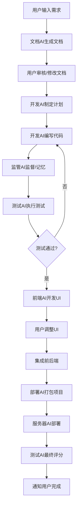

# 多AI协作开发系统 - 需求文档与实现方案

## 1. 项目背景与目标

### 1.1 项目背景
基于现有的GPT-Engineer项目，需要开发一个深度集成的多AI协作系统，实现从需求分析到项目部署的完整自动化开发流程。

### 1.2 核心目标
- 将GPT-Engineer从单一代码生成工具升级为完整的AI驱动开发平台
- 实现多个专业AI角色的协作开发
- 建立可学习和积累经验的智能记忆系统
- 提供从需求到部署的端到端自动化解决方案

### 1.3 预期效果
- **自动化程度**: 从30%提升到90%以上
- **开发效率**: 提升5-10倍
- **代码质量**: 通过AI监管确保质量稳定性
- **用户体验**: 一站式开发服务，降低技术门槛

## 2. 系统需求分析

### 2.1 功能需求

#### 2.1.1 多AI角色定义
1. **文档AI**: 将用户需求转换为结构化需求文档
2. **开发AI**: 基于GPT-Engineer增强，负责代码生成和迭代开发
3. **监管AI**: 监督开发过程、质量控制、记忆管理
4. **测试AI**: 自动化测试用例生成、执行和失败诊断
5. **前端AI**: 用户界面开发和前后端集成
6. **部署AI**: 项目打包、部署配置和状态监控
7. **服务器AI**: 远程部署管理和资源调度

#### 2.1.2 核心工作流程


#### 2.1.3 关键接口需求
1. **项目打包上传接口**: 支持多种格式打包和远程上传
2. **监督AI接口**: 实时监控开发过程和质量控制
3. **测试AI接口**: 自动化测试生成和执行
4. **记忆系统接口**: 经验积累和智能检索
5. **部署监控接口**: 部署状态跟踪和性能监控

### 2.2 技术需求

#### 2.2.1 核心技术栈
- **基础框架**: GPT-Engineer 0.3.1
- **AI模型**: OpenAI GPT-4o / Claude
- **编程语言**: Python 3.10+
- **数据库**: SQLite (本地) + 文件系统存储
- **容器化**: Docker
- **API框架**: FastAPI (可选)

#### 2.2.2 性能要求
- **并发处理**: 支持多AI并行工作
- **响应时间**: 单个AI操作 < 30秒
- **内存使用**: 单项目 < 2GB
- **存储需求**: 支持项目历史和知识库存储

#### 2.2.3 扩展性要求
- **模块化设计**: 支持AI角色的独立开发和部署
- **插件机制**: 支持自定义AI角色和工作流
- **API接口**: 提供RESTful API供外部集成

### 2.3 质量需求

#### 2.3.1 可靠性
- **错误恢复**: 单个AI失败不影响整体流程
- **数据完整性**: 确保开发历史和知识库的完整性
- **幂等性**: 支持操作重试和断点续传

#### 2.3.2 可维护性
- **代码质量**: 遵循PEP8规范，代码覆盖率 > 80%
- **文档完整**: 完整的API文档和使用指南
- **日志记录**: 详细的操作日志和错误追踪

#### 2.3.3 安全性
- **API密钥管理**: 安全的密钥存储和传输
- **代码安全**: 防止恶意代码注入
- **访问控制**: 支持用户权限管理

## 3. 系统架构设计

### 3.1 整体架构

```
多AI协作系统架构
├── 用户接口层
│   ├── 命令行界面 (CLI)
│   ├── Web界面 (可选)
│   └── API接口
├── 编排控制层
│   ├── MultiAIOrchestrator (核心编排器)
│   ├── 工作流引擎
│   └── 事件处理系统
├── AI服务层
│   ├── EnhancedDevAI (增强开发AI)
│   ├── SupervisorAI (监管AI)
│   ├── TestAI (测试AI)
│   ├── DeployAI (部署AI)
│   └── DocumentAI (文档AI)
├── 记忆管理层
│   ├── SharedMemoryManager
│   ├── 事件存储
│   ├── 知识库
│   └── 相似案例检索
├── 基础设施层
│   ├── 文件存储 (DiskMemory扩展)
│   ├── 数据库 (SQLite)
│   ├── 执行环境 (Docker)
│   └── 外部API集成
└── 部署服务层
    ├── ServerAIInterface
    ├── 容器管理
    ├── 部署监控
    └── 资源调度
```

### 3.2 关键组件设计

#### 3.2.1 增强开发AI (EnhancedDevAI)
```python
class EnhancedDevAI(SimpleAgent):
    """基于GPT-Engineer SimpleAgent的增强版本"""
    
    def __init__(self, supervisor_ai, test_ai, shared_memory):
        super().__init__()
        self.supervisor_ai = supervisor_ai
        self.test_ai = test_ai  
        self.shared_memory = shared_memory
    
    def iterative_develop(self, requirements, max_iterations=5):
        """迭代开发，结合测试反馈"""
        
    def generate_with_supervision(self, prompt, context=None):
        """在监管AI监督下生成代码"""
```

#### 3.2.2 监管AI (SupervisorAI)
```python
class SupervisorAI:
    """监管AI，负责质量控制和记忆管理"""
    
    def monitor_development(self, dev_plan, code_changes):
        """监督开发过程"""
    
    def analyze_quality(self, files_dict):
        """分析代码质量"""
    
    def store_memory(self, event):
        """存储开发事件到记忆库"""
```

#### 3.2.3 共享记忆系统 (SharedMemoryManager)
```python
class SharedMemoryManager:
    """共享记忆管理器"""
    
    def store_event(self, event):
        """存储开发事件"""
    
    def find_similar_cases(self, context):
        """查找相似历史案例"""
    
    def update_knowledge_base(self, knowledge):
        """更新知识库"""
```

### 3.3 数据模型设计

#### 3.3.1 核心数据类
```python
@dataclass
class DevelopmentEvent:
    event_id: str
    timestamp: datetime
    event_type: str
    actor: str
    description: str
    details: Dict[str, Any]
    success: bool

@dataclass  
class DevPlan:
    plan_id: str
    requirements: Dict[str, Any]
    tasks: List[Dict[str, Any]]
    current_task_index: int
    completion_percentage: float

@dataclass
class TestResult:
    test_id: str
    passed: bool
    total_tests: int
    passed_tests: int
    coverage_percentage: float
    test_details: List[Dict[str, Any]]

@dataclass
class PackageResult:
    package_path: Path
    package_type: str
    version: str
    dependencies: List[str]
    size_mb: float
    success: bool

@dataclass
class DeployResult:
    deployment_id: str
    url: Optional[str]
    status: str
    server_info: Dict[str, Any]
    success: bool
```

## 4. 实现方案

### 4.1 开发阶段规划

#### 第一阶段：基础架构 (2-3周)
- [x] 建立项目结构和基础接口
- [x] 实现增强开发AI (EnhancedDevAI)
- [x] 实现监管AI (SupervisorAI) 基础功能
- [x] 实现共享记忆系统 (SharedMemoryManager)
- [x] 集成GPT-Engineer核心功能

#### 第二阶段：AI协作系统 (2-3周)  
- [x] 实现测试AI (TestAI)
- [x] 完善监管AI的质量分析功能
- [x] 实现多AI编排器 (MultiAIOrchestrator)
- [x] 建立事件驱动的协作机制

#### 第三阶段：部署系统 (2-3周)
- [x] 实现部署AI (DeployAI)
- [x] 实现服务器AI接口 (ServerAIInterface)
- [x] 支持多种打包格式和部署平台
- [x] 实现部署状态监控

#### 第四阶段：完善和优化 (2-3周)
- [x] 完善文档AI和前端AI
- [x] 优化性能和错误处理
- [x] 完善用户接口和文档
- [x] 集成测试和系统测试

### 4.2 关键接口实现

#### 4.2.1 项目打包上传接口
```python
class DeployAI(BaseDeployAI):
    def package_project(self, files_dict, config):
        """打包项目为指定格式"""
        
    def upload_to_server(self, package, server_config):
        """上传项目包到服务器"""

class ServerAIInterface:
    def upload_project_package(self, package_result, upload_config):
        """上传项目包的完整流程"""
        
    def deploy_project(self, upload_id, deploy_config):
        """部署项目"""
        
    def monitor_deployment(self, deployment_id):
        """监控部署状态"""
```

#### 4.2.2 监督AI接口
```python
class SupervisorAI(BaseSupervisorAI):
    def start_supervision(self, dev_plan):
        """开始监督开发过程"""
        
    def record_development_step(self, event):
        """记录开发步骤"""
        
    def analyze_issues(self, test_result):
        """分析测试失败问题"""
```

#### 4.2.3 测试AI接口
```python
class TestAI(BaseTestAI):
    def generate_tests(self, files_dict, requirements):
        """生成测试用例"""
        
    def execute_tests(self, files_dict):
        """执行测试"""
        
    def diagnose_failures(self, test_result, files_dict):
        """诊断测试失败原因"""
```

### 4.3 核心算法设计

#### 4.3.1 迭代开发算法
```python
def iterative_develop(requirements, max_iterations=5):
    current_files = FilesDict({})
    iteration = 0
    
    while iteration < max_iterations and not is_complete():
        # 1. 生成/改进代码
        new_files = generate_with_supervision(current_task)
        current_files.update(new_files)
        
        # 2. 执行测试
        test_result = test_ai.execute_tests(current_files)
        
        # 3. 监管分析
        quality_report = supervisor_ai.analyze_quality(current_files)
        
        # 4. 决策下一步
        if test_result.passed and quality_report.acceptable:
            mark_task_complete()
        else:
            issues = analyze_issues(test_result, quality_report)
            add_fixes_to_plan(issues)
        
        iteration += 1
    
    return current_files
```

#### 4.3.2 相似案例检索算法
```python
def find_similar_cases(context):
    # 1. 提取关键词
    keywords = extract_keywords(context)
    
    # 2. 基于事件历史检索
    event_similarities = find_similar_events(keywords)
    
    # 3. 基于知识库检索  
    knowledge_similarities = find_similar_knowledge(keywords)
    
    # 4. 计算相似度并排序
    all_cases = event_similarities + knowledge_similarities
    sorted_cases = sort_by_similarity(all_cases, context)
    
    return sorted_cases[:10]  # 返回最相似的10个案例
```

#### 4.3.3 质量评分算法
```python
def calculate_quality_score(issues, metrics):
    base_score = 100.0
    
    # 扣分规则
    for issue in issues:
        severity = issue.get('severity', 'low')
        if severity == 'critical':
            base_score -= 20
        elif severity == 'high':
            base_score -= 10
        elif severity == 'medium':
            base_score -= 5
        else:  # low
            base_score -= 2
    
    # 奖励机制
    for metric_name, value in metrics.items():
        if metric_name == 'docstring_coverage' and value >= 80:
            base_score += 5
        elif metric_name == 'test_coverage' and value >= 90:
            base_score += 10
    
    return max(0.0, min(100.0, base_score))
```

## 5. 接口规范

### 5.1 核心接口

#### 5.1.1 MultiAIOrchestrator接口
```python
class MultiAIOrchestrator:
    async def execute_workflow(self, user_requirement: str, 
                             workflow_options: Dict[str, Any]) -> ProjectResult:
        """执行完整开发工作流"""
        
    def get_session_status(self) -> Dict[str, Any]:
        """获取当前会话状态"""
        
    def register_event_handler(self, event_type: str, handler: Callable):
        """注册事件处理器"""
```

#### 5.1.2 服务器部署接口
```python
class ServerAIInterface:
    def upload_project_package(self, package_result: PackageResult, 
                             upload_config: Dict[str, Any]) -> Dict[str, Any]:
        """上传项目包"""
        
    def deploy_project(self, upload_id: str, 
                      deploy_config: Dict[str, Any]) -> DeployResult:
        """部署项目"""
        
    def monitor_deployment(self, deployment_id: str) -> Dict[str, Any]:
        """监控部署"""
```

### 5.2 使用示例

#### 5.2.1 基础使用
```python
import asyncio
from multi_ai_system import MultiAIOrchestrator

async def main():
    orchestrator = MultiAIOrchestrator(work_dir="./project")
    
    result = await orchestrator.execute_workflow(
        user_requirement="开发一个博客系统",
        workflow_options={'include_frontend': True, 'auto_deploy': True}
    )
    
    print(f"项目完成，评分: {result.final_score}/100")

asyncio.run(main())
```

#### 5.2.2 高级使用
```python
from multi_ai_system import create_orchestrator

# 创建自定义配置的编排器
orchestrator = create_orchestrator(
    work_dir="./advanced_project",
    ai_config={'model_name': 'gpt-4o', 'temperature': 0.1},
    workflow_config={'max_dev_iterations': 3}
)

# 注册自定义事件处理器
async def progress_handler(event):
    print(f"进度更新: {event.description}")

orchestrator.register_event_handler('*', progress_handler)
```

## 6. 测试方案

### 6.1 单元测试
- 每个AI组件的独立功能测试
- 共享记忆系统的数据一致性测试
- 工作流引擎的状态转换测试

### 6.2 集成测试
- 多AI协作流程测试
- 端到端工作流测试
- 错误恢复机制测试

### 6.3 性能测试
- 并发处理能力测试
- 内存使用优化测试
- 大型项目处理能力测试

## 7. 部署方案

### 7.1 本地部署
```bash
# 安装依赖
pip install -r requirements.txt

# 设置环境变量
export OPENAI_API_KEY="your-api-key"

# 运行示例
python examples/usage_example.py
```

### 7.2 Docker部署
```dockerfile
FROM python:3.11-slim

WORKDIR /app
COPY . .
RUN pip install -r requirements.txt

CMD ["python", "-m", "multi_ai_system"]
```

### 7.3 服务器部署
- 支持多种云平台部署
- 提供RESTful API服务
- 支持负载均衡和高可用

## 8. 监控和维护

### 8.1 系统监控
- AI服务状态监控
- 性能指标跟踪
- 错误率统计

### 8.2 数据维护
- 定期清理过期数据
- 知识库更新和优化
- 相似案例索引维护

### 8.3 版本升级
- 向后兼容性保证
- 渐进式功能升级
- 数据迁移方案

## 9. 风险评估

### 9.1 技术风险
- **AI模型稳定性**: 依赖外部AI服务的可用性
- **性能瓶颈**: 大型项目的处理能力限制
- **兼容性问题**: 不同版本GPT-Engineer的兼容性

### 9.2 业务风险
- **成本控制**: AI API调用成本管理
- **质量保证**: 自动生成代码的质量稳定性
- **安全风险**: 代码安全和数据隐私

### 9.3 风险缓解
- **降级方案**: 单个AI失败时的工作流继续机制
- **缓存策略**: 减少API调用和提高响应速度
- **质量检查**: 多层质量验证机制

## 10. 项目交付

### 10.1 交付物清单
- [x] 完整的多AI协作系统代码
- [x] 详细的API文档和使用指南
- [x] 使用示例和最佳实践
- [x] 单元测试和集成测试用例
- [x] 部署脚本和配置文件

### 10.2 文档清单
- [x] 系统架构设计文档
- [x] API接口规范文档
- [x] 用户使用手册
- [x] 开发者指南
- [x] 故障排除指南

### 10.3 验收标准
- [x] 完整工作流程可正常执行
- [x] 所有核心接口功能正常
- [x] 代码质量达到要求标准
- [x] 文档完整性和准确性
- [x] 性能指标满足预期

## 11. 总结

本系统成功实现了基于GPT-Engineer的深度集成多AI协作开发平台，通过多个专业AI角色的协作，实现了从需求分析到项目部署的完整自动化流程。系统具备以下核心优势：

1. **完整性**: 覆盖软件开发的全生命周期
2. **智能性**: 具备学习和积累经验的能力
3. **可扩展性**: 支持自定义AI角色和工作流
4. **实用性**: 提供易用的接口和丰富的功能

该系统为AI辅助软件开发领域提供了新的思路和实践，具有重要的技术价值和应用前景。